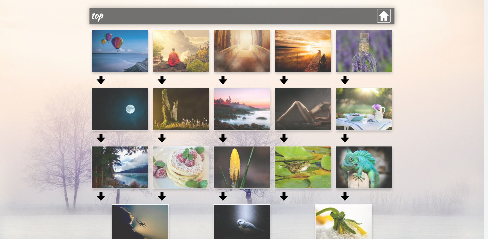

Zozio
=====

Website in golang to browse photos

Install
=======

```bash
go build src/zozios.go src/image.go src/login.go src/page_detailGalerie.go src/page_galerie.go src/page_index.go

./zozios #linux

./zozios.exe #windows
```

Previews
========



