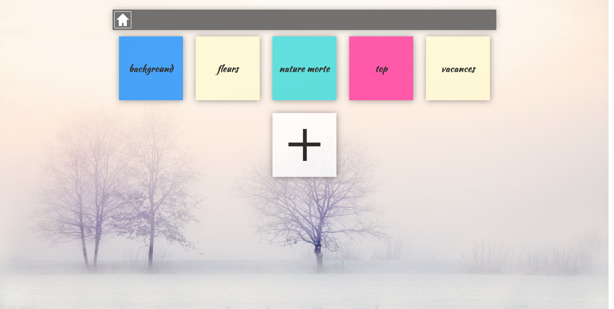
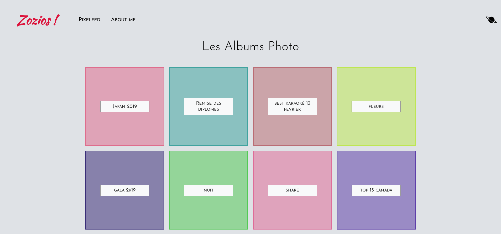
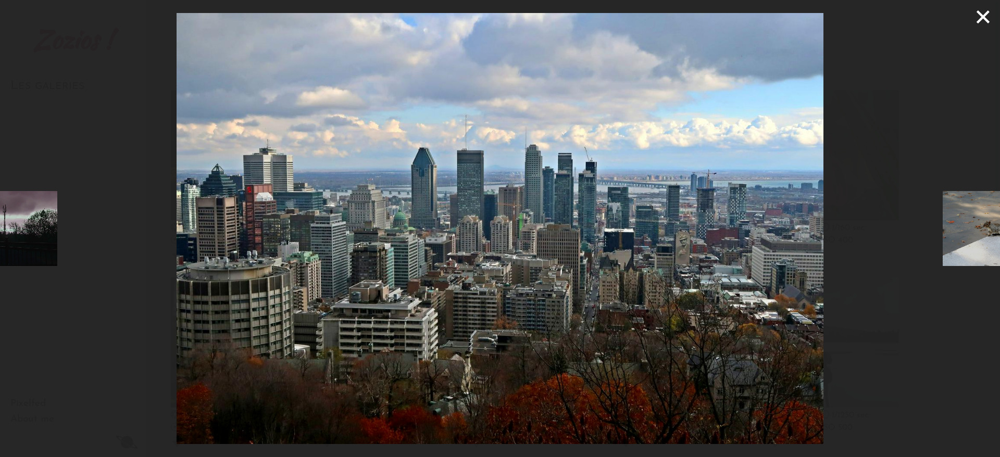

Zozio
=====

Website in golang to browse photos

Install
=======
you need to install exif-dev with your package manager

```bash
go get github.com/xiam/exif github.com/nfnt/resize github.com/gorilla/sessions github.com/gorilla/mux github.com/disintegration/imaging

go build src/zozios.go src/image.go src/login.go src/page_detailGalerie.go src/page_galerie.go src/page_index.go src/randomImage.go src/night.go

./zozios #linux

./zozios.exe #windows
```

open http://localhost:8764/

Use
===

 * To create a galery, you need to create a folder in `static/galerie/<name galery>`
 * If you want to set the galery private you have to create a file "private.txt" in the galery folder
 * Url to the galery is `<url website>/galerie/<name galery>.html `
 * you can get a random image on `<url website>/random/<name galery>.html `

Previews
========






