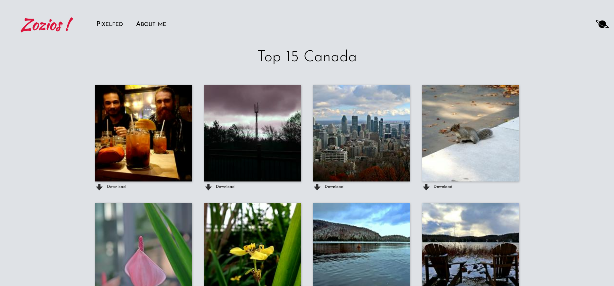

Zozio
=====

Website in golang to browse photos

Install
=======

```bash
go build src/zozios.go src/image.go src/login.go src/page_detailGalerie.go src/page_galerie.go src/page_index.go

./zozios #linux

./zozios.exe #windows
```

Use
===

 * To create a galery, you need to create a folder in `static/galerie/<name galery>`
 * If you want to set the galery private you have to create a file "private.txt" in the galery folder 
 * Url to the galery is `<url website>/galerie/<name galery>.html `
 * you can get a random image on `<url website>/random/<name galery>.html `

Previews
========




